# Enterprise Architecture Workshop: Secure Application Design

A two-server secure architecture deployed on AWS, featuring an Apache HTTPS frontend and a Spring Boot REST backend, both protected with TLS and authentication.

---

## Architecture Overview

```
Browser
   │
   │  HTTPS (Let's Encrypt)
   ▼
┌─────────────────────┐
│   Server 1 (EC2)    │
│   Apache HTTP       │
│   tdseci.duckdns.org│
│   Port 443          │
└─────────────────────┘
          │
          │  HTTPS (REST calls)
          ▼
┌─────────────────────┐
│   Server 2 (EC2)    │
│   Spring Boot       │
│   Self-signed TLS   │
│   Port 8080         │
└─────────────────────┘
```

| Component | Technology | TLS |
|---|---|---|
| Frontend server | Apache httpd on Amazon Linux 2023 | Let's Encrypt via Certbot |
| Backend API | Spring Boot 4.0.1 (Java 25) | Self-signed PKCS12 keystore |
| DNS | DuckDNS free dynamic DNS | — |
| Auth | BCrypt password hashing | — |

---

## Prerequisites

- Two EC2 instances (Amazon Linux 2023) with the following Security Group rules:
  - Server 1 (Apache): ports 80 and 443 open
  - Server 2 (Spring): port 8080 open
- A free DuckDNS account and subdomain pointing to Server 1's public IP
- Java 25 and Maven installed locally (for building the Spring app)
- Docker installed on Server 2 (optional, for containerized deploy)

---

## Server 1 — Apache with Let's Encrypt TLS

### 1. Install Apache

```bash
sudo dnf install -y httpd wget
sudo systemctl start httpd
sudo systemctl enable httpd
```

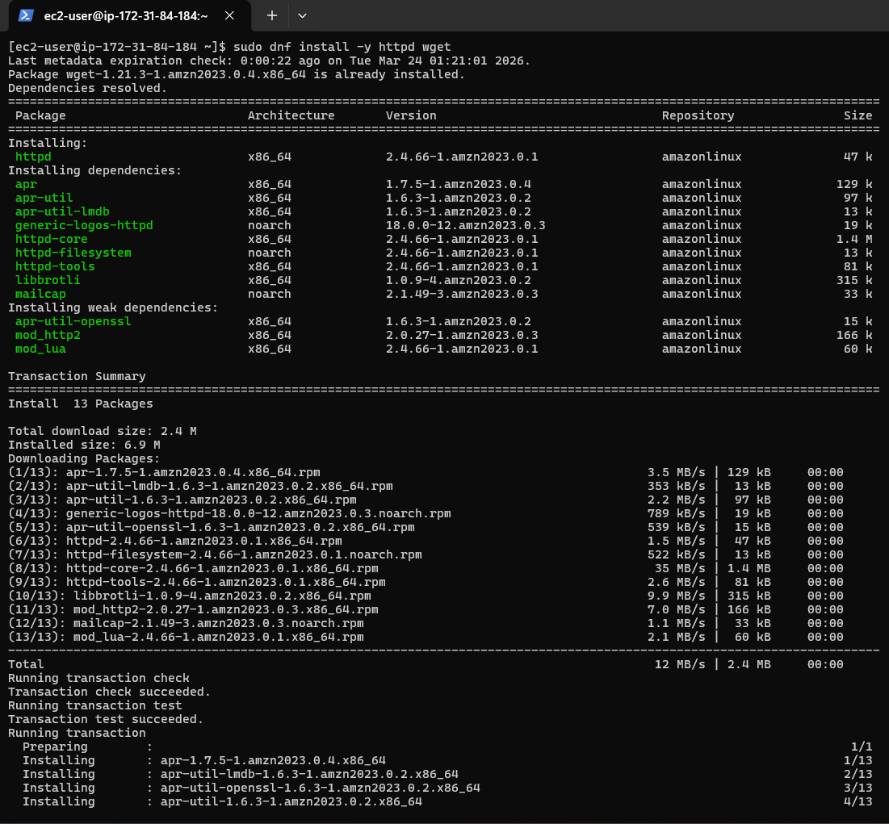
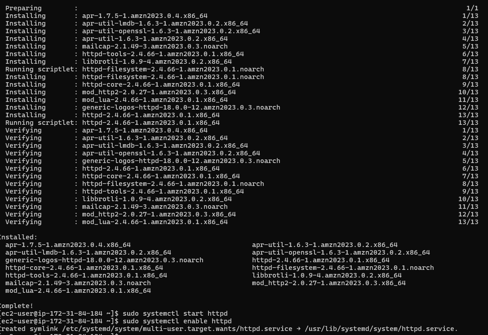

Verify Apache is running by visiting the EC2 public DNS in a browser:

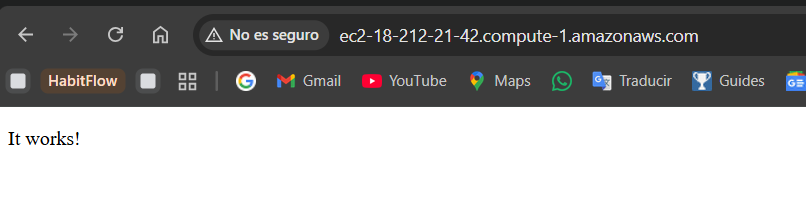

### 2. Configure DuckDNS

Go to [duckdns.org](https://www.duckdns.org), create a subdomain, and point it to your EC2 public IP.

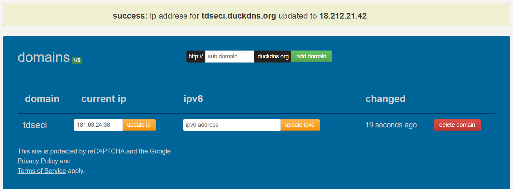

Verify the domain resolves correctly:

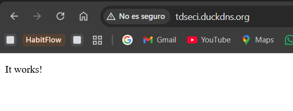

### 3. Configure a VirtualHost

Create the file `/etc/httpd/conf.d/tdseci.duckdns.org.conf`:

```apacheconf
<VirtualHost *:80>
    ServerName tdseci.duckdns.org

    DocumentRoot /var/www/html

    <Directory /var/www/html>
        AllowOverride All
        Require all granted
    </Directory>

    ErrorLog /var/log/httpd/tdseci_error.log
    CustomLog /var/log/httpd/tdseci_access.log combined
</VirtualHost>
```

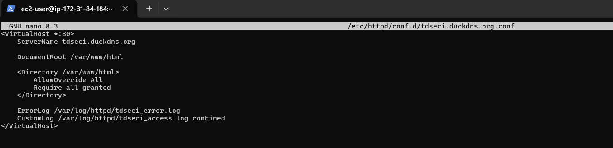

Restart Apache:

```bash
sudo systemctl restart httpd
```

### 4. Install Certbot and obtain a Let's Encrypt certificate

Install Certbot dependencies:

```bash
sudo dnf install -y python3 augeas-devel
sudo python3 -m venv /opt/certbot/
sudo /opt/certbot/bin/pip install --upgrade pip
```

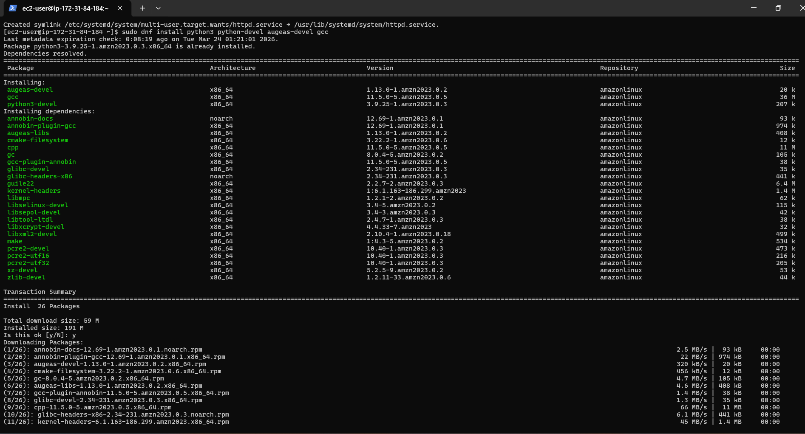

Install Certbot with the Apache plugin:

```bash
sudo /opt/certbot/bin/pip install certbot certbot-apache
```

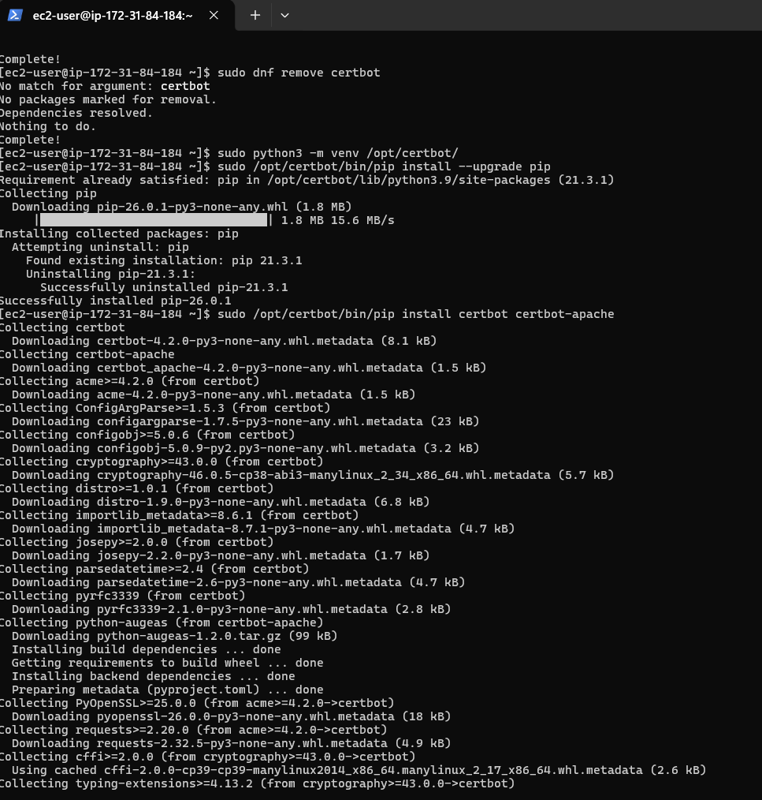

Request the certificate:

```bash
sudo /opt/certbot/bin/certbot --apache
```

Follow the interactive prompts: enter your email, agree to the ToS, and select your domain (`tdseci.duckdns.org`).

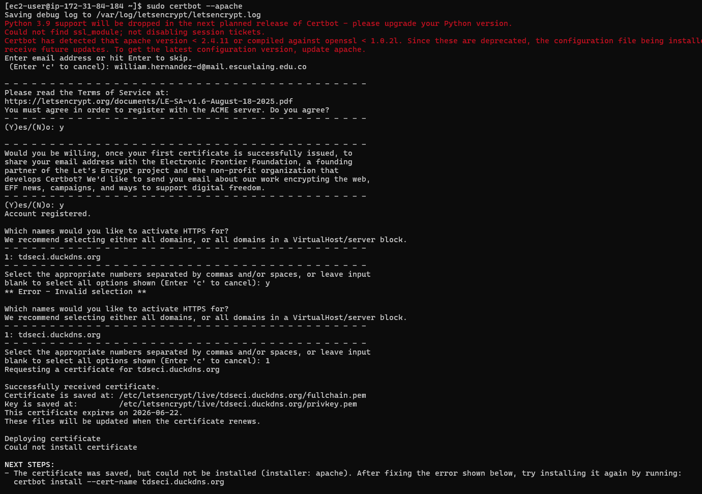

The certificate is saved to `/etc/letsencrypt/live/tdseci.duckdns.org/`. Certbot automatically updates the Apache VirtualHost to redirect HTTP → HTTPS.

Verify the secure connection in the browser:

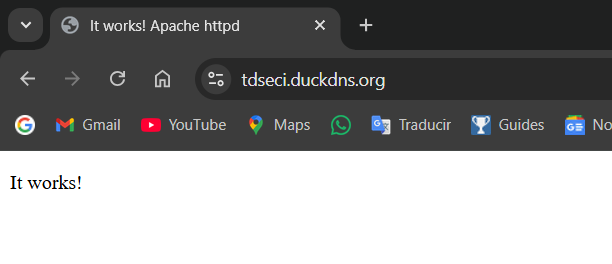

---

## Server 2 — Spring Boot with TLS

### 1. Generate the self-signed keystore

Run this command from the project root:

```bash
keytool -genkeypair -alias ecikeypair -keyalg RSA -keysize 2048 \
  -storetype PKCS12 \
  -keystore src/main/resources/keystore/ecikeystore.p12 \
  -storepass 123456 -validity 365
```

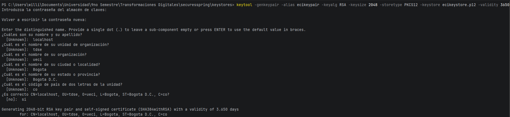

Verify the certificate details:

```bash
keytool -list -v -keystore src/main/resources/keystore/ecikeystore.p12 -storepass 123456
```

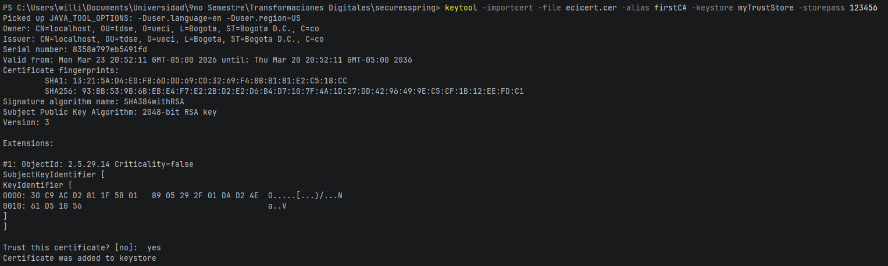

### 2. SSL configuration (`application.properties`)

The keystore is embedded in the jar via `classpath:`:

```properties
server.ssl.key-store-type=PKCS12
server.ssl.key-store=classpath:keystore/ecikeystore.p12
server.ssl.key-store-password=123456
server.ssl.key-alias=ecikeypair
server.ssl.enabled=true
```

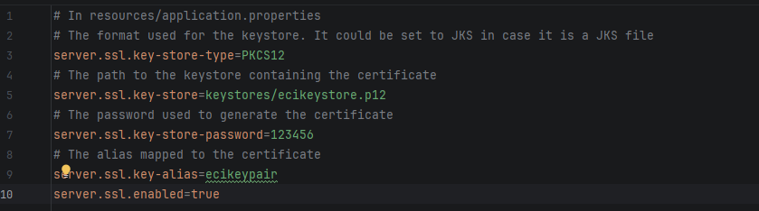

### 3. Maven dependencies (`pom.xml`)

```xml
<dependency>
    <groupId>org.springframework.boot</groupId>
    <artifactId>spring-boot-starter-web</artifactId>
    <version>4.0.1</version>
</dependency>
<dependency>
    <groupId>org.springframework.boot</groupId>
    <artifactId>spring-boot-starter-security</artifactId>
    <version>4.0.2</version>
</dependency>
```

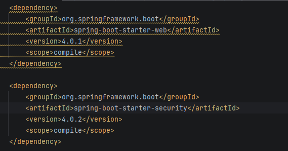

### 4. Build and run

```bash
# Build
mvn package

# Run locally
java -jar target/securesspring-1.0-SNAPSHOT.jar

# Or with Docker
docker build -t securesspring .
docker run -d -p 8080:8080 --name securesspring securesspring
```

Verify the app is running at `https://localhost:8080/`:

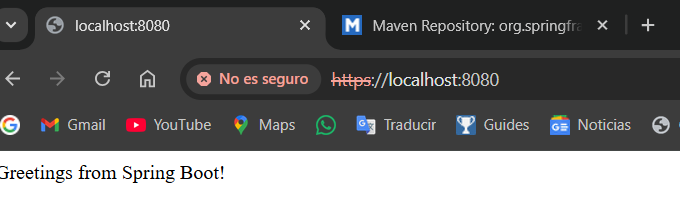

### 5. Test the login endpoint

**Successful login (HTTP 200):**

```http
POST https://localhost:8080/auth/login
Content-Type: application/json

{
  "username": "admin",
  "password": "admin123"
}
```

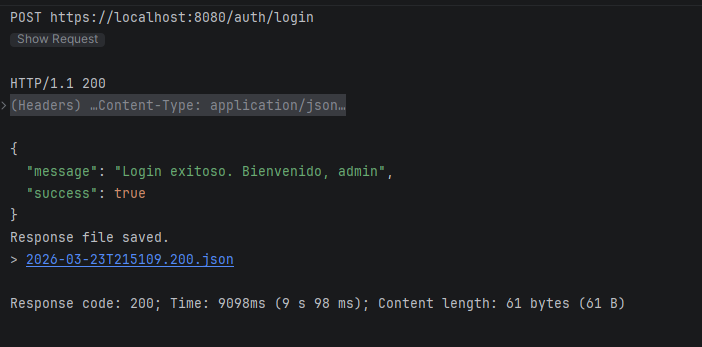

**Invalid credentials (HTTP 401):**

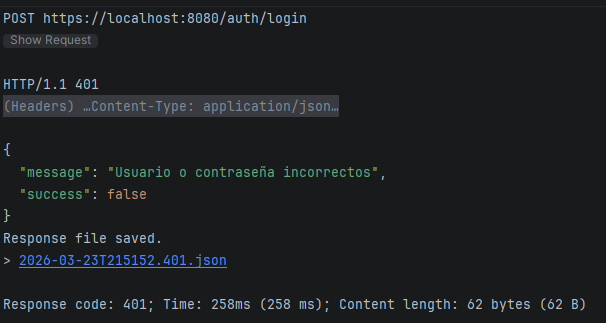

---

## Deploying the Spring Backend to EC2

### 1. Build the Docker image and run it on the EC2

SSH into the Spring server EC2 instance, clone the repository, and run:

```bash
docker build -t securesspring .
docker run -d -p 8080:8080 --name securesspring securesspring
```

The build stage compiles the application inside the container using Maven. Once complete, Docker starts the container and maps port 8080. Confirm the container is running with `docker ps`.

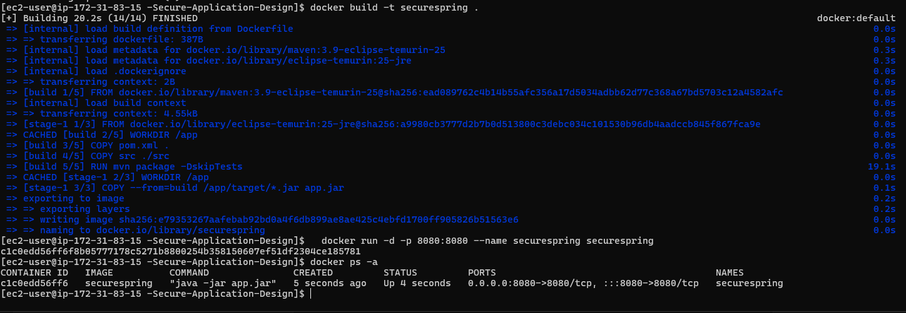

### 2. Verify the Spring service is reachable

Test the backend directly against the EC2 public DNS on port 8080. Since the certificate is self-signed, use a REST client with TLS verification disabled (`-k` with curl, or "Disable SSL verification" in tools like IntelliJ HTTP Client):

```
GET https://<EC2_PUBLIC_DNS>:8080/
```

Expected response: `Greetings from Spring Boot!` with HTTP 200.

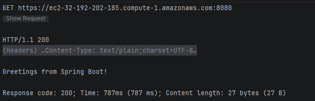

### 3. End-to-end test through the Apache frontend

With both servers running, navigate to `https://tdseci.duckdns.org` in a browser. The Apache server delivers the async HTML+JS client, which calls the Spring backend on port 8080. Enter valid credentials and click **Iniciar sesión** — the client sends a `POST /auth/login` request to Spring and displays the response.

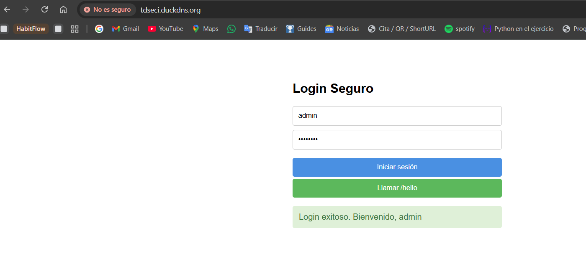

---

## Security Features

| Feature | Implementation |
|---|---|
| HTTPS on Apache | Let's Encrypt certificate via Certbot |
| HTTPS on Spring | Self-signed PKCS12 keystore (`keytool`) |
| Password storage | BCrypt hashing via `BCryptPasswordEncoder` |
| CSRF protection | Disabled (stateless REST API) |
| CORS | Configured to allow only specific origins |
| Public routes | Only `GET /` and `POST /auth/login` are unauthenticated |

### Pre-loaded users

| Username | Password |
|---|---|
| `admin` | `admin123` |
| `estudiante` | `eci2024` |

Passwords are never stored in plain text — only their BCrypt hashes are kept in memory.

---

## API Reference

| Method | Endpoint | Auth required | Description |
|---|---|---|---|
| GET | `/` | No | Health check — returns greeting string |
| POST | `/auth/login` | No | Authenticate user |

**Login request body:**
```json
{
  "username": "string",
  "password": "string"
}
```

**Login response:**
```json
{
  "success": true,
  "message": "Login exitoso. Bienvenido, admin"
}
```

---

## Demo Video

> Video demonstrating the full deployment and security features:

<!-- Replace this comment with the video link or embed once available -->
> 🎥 _Video coming soon_

---

## Author

William Hernandez — Escuela Colombiana de Ingeniería Julio Garavito
